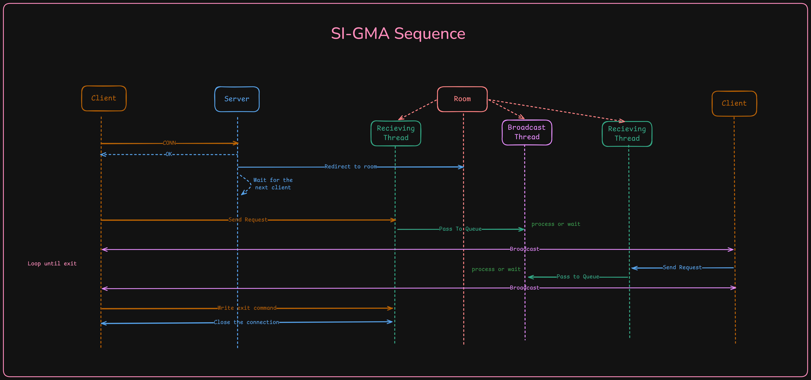
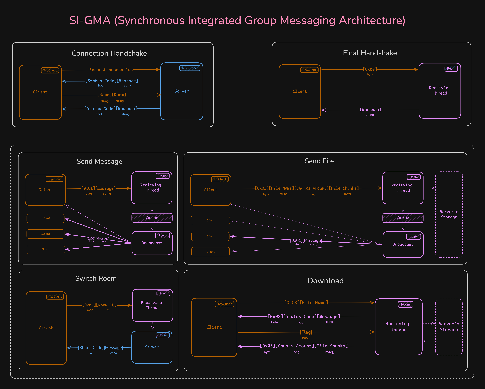

# SI-GMA Chat: Multithreaded TCP Client-Server Application


A robust, multithreaded client-server chat application built from scratch using C# and raw TCP sockets. This project features isolated chat rooms, a custom application-layer protocol, and reliable chunk-based file transfers. 

The core of this project is built on a custom architecture named **SI-GMA** (Synchronous Integrated Group Messaging Architecture), designed to handle concurrent user requests, prevent deadlocks, and ensure thread safety without relying on high-level HTTP frameworks.

## ✨ Key Features

* **Custom Byte-Level Protocol (SI-GMA):** Efficient network traffic routing using precise byte prefixes to separate text messages from file chunks and system commands.
* **Concurrency & Thread Safety:** Handles multiple clients simultaneously using `Task.Run()` background threads. Uses `lock` and `ConcurrentDictionary` to prevent race conditions during message broadcasting.
* **Chunked File Transfer:** Safe upload and download of large files using `FileStream` and small byte buffers (4KB-8KB) to prevent server RAM exhaustion.
* **Isolated Chat Rooms:** Users can dynamically create or switch between isolated chat rooms. File storage is also scoped per room.
* **Asynchronous UX:** The client separates reading (background thread) and writing (main thread), ensuring the CLI remains responsive even while waiting for server responses or downloading files.

## 🏗️ Architecture & Protocol

The application relies on a strictly defined, asymmetric packet structure (SI-GMA) to differentiate between data types. The byte codes carry different meanings depending on the direction of the data flow.

### SI-GMA Protocol Map (Asymmetric Routing)

**Client ➔ Server (Requests):**
* `[0x01]` - Send Text Message
* `[0x02]` - Upload File (Followed by filename, size, and data chunks)
* `[0x03]` - Download File Request (Followed by target filename)
* `[0x04]` - Room Switch Request (Followed by target room ID)
* `[0x05]` - Graceful Disconnect

**Server ➔ Client (Responses & Broadcasts):**
* `[0x01]` - Broadcast Text Message / System Notification
* `[0x02]` - File Status Response (Returns boolean availability and prompt message)
* `[0x03]` - File Data Transmission (Returns filename, size, and initiates chunk stream)

### Flow Diagrams

Here is a visual representation of the SI-GMA architecture, illustrating the asymmetric code interpretation:



**File Transfer Flow:**
To avoid stream corruption and race conditions between threads, the file download process utilizes a highly controlled handshake before chunk transmission begins.



## 🚀 Getting Started

### Prerequisites
* .NET 8.0 SDK (or later)

### Running the Server
1. Navigate to the `Server` directory.
2. Run the application:
   ```bash
   dotnet run
   ```
3. The server will start listening on `127.0.0.1:12345` (default) and automatically create a `Rooms/` directory for file storage.

### Running the Client
1. Navigate to the `Client` directory.
2. Run the application:
   ```bash
   dotnet run
   ```
3. Follow the on-screen prompts to enter your Name and the Room ID you wish to join.

## 🛠️ Commands

Once connected, you can use the following commands in the chat:

* `/room <number>` - Switch to a different chat room (e.g., `/room 2`).
* `/upload <path>` - Upload a file from your local machine to the current room (e.g., `/upload C:\photo.png`).
* `/download <name>` - Request a file that has been uploaded to the current room (e.g., `/download photo.png`). You will be prompted to confirm `(Y/n)` before the download begins.
* `exit` - Gracefully terminate the connection.

## 🧠 Technical Highlights for Developers

* **Race Condition Mitigation:** Implemented a state-flag system (`_pendingDownloadFile`) to ensure the main UI thread safely intercepts user keyboard input `(Y/n)` without stealing bytes from the `BinaryReader` running on the background listening thread.
* **Memory Management:** Both client and server utilize `Math.Min()` during stream reading loops to ensure that large network packets are perfectly sliced according to the remaining `fileSize`, preventing `EndOfStreamException` and memory leaks.
* **Deadlock Prevention:** Broadcast logic utilizes `Monitor.Wait` and `Monitor.PulseAll` to keep background workers idle until a new message arrives, preserving CPU cycles.
